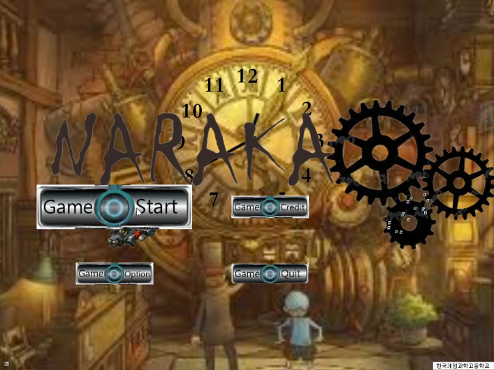
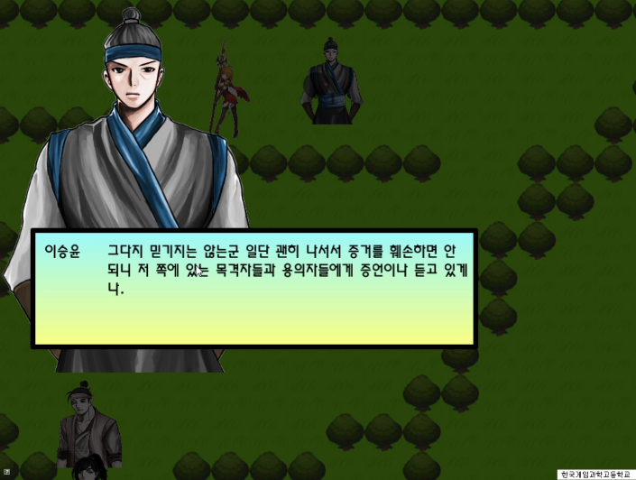
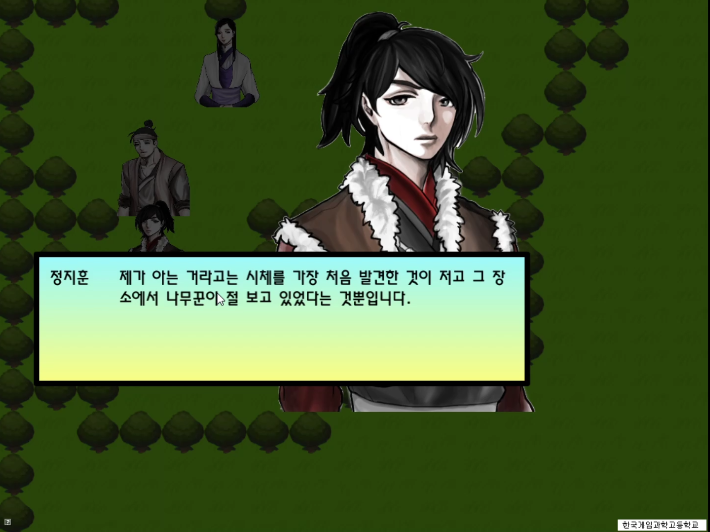
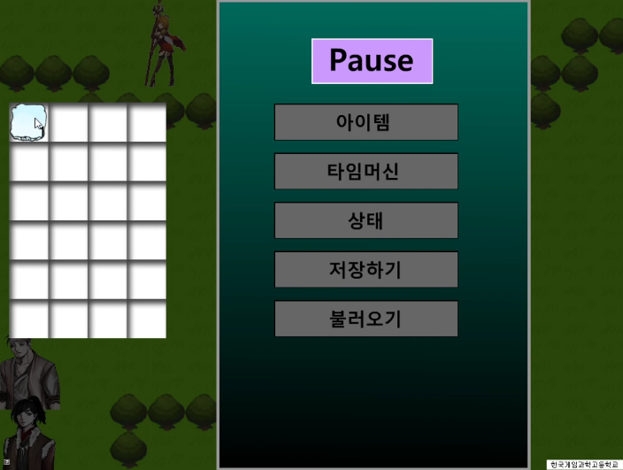

# TimeKeeper
|  |  |
| ---------------- | ---------------- |
|  |  |

### 한국게임과학고등학교 2학년 팀프로젝트

프로젝트 소개 : TimeKeeper는 과거로 여행을 떠나 일어나는 사건을 조사해나가는 추리게임입니다.

사용 기술 : C++, EM엔진(한국게임과학고등학교 교내엔진)

담당 역할 : 팀장, 프로그래밍 (UI메뉴 제외 게임 작업)

개발기간 : 2012년 6월~ 2012년 11월

핵심 기술 / 알고리즘 : 한글 텍스트를 순차적으로 재생시켜주는 기능. 파일입출력을 통한 타일 맵 시스템 구현. 여러 맵 사이의 전환. 이동 및 NPC 상호작용. NPC채팅 시스템.

플레이영상 : https://youtu.be/WKIJbArL8aM

프로젝트 주소 : https://github.com/justkoi/TimeKeeper

### 핵심 코드 설명

#### CHero.cpp::MoveUpdate : 캐릭터 이동 및 맵에 위치한 장애물(블록)과의 충돌처리, 포탈과의 충돌처리.

https://github.com/justkoi/TimeKeeper/blob/main/%EA%B2%8C%EC%9E%84%ED%8C%8C%EC%9D%BC(C%2B%2B%2CEMEngine)/TimeKeeper/TimeKeeper/Hero.cpp

캐릭터가 이동할 방향의 다음위치로 미리 이동해보고 블록과 충돌했다면 현재 이동을 중지시킵니다.

```C++
void CHero::MoveUpdate(float dt, CMapManager* MapManager, CInventory* Inventory)
{

	for(int i=0; i<E_Derection_Max; i++)
	{
		m_bKeyDown[i] = false;
		m_bHitTest[i] = false;
	}
	
	m_bNPCHit = false;
	
	if(g_bChating == false && g_bPause == false)
	{
		if(GetKeyState(VK_LEFT) & 0x8000)
		{
			m_eDerection = E_Derection_Left;
			m_pHero[m_eDerection]->SetPause(false);
			list<CBlokingBlock*>::iterator it;
			for(it = MapManager->getCurMap()->m_BlokingMap.begin(); it != MapManager->getCurMap()->m_BlokingMap.end(); it++)
			{
				stEMVec2 stTemp1 = m_stPos;
				stTemp1.m_fX = stTemp1.m_fX - (m_fMoveSpeed * dt);//  //
				stTemp1.m_fY = stTemp1.m_fY; //
			

				stEMVec2 stTemp2 = (*it)->getPos();
				stTemp2.m_fX = stTemp2.m_fX;//  //
				stTemp2.m_fY = stTemp2.m_fY; //
			
				if(HitTest(stTemp1, stEMVec2(D_HERO_WIDTH,D_HERO_HEIGHT), stTemp2,stEMVec2(D_TILE_WIDTH,D_TILE_HEIGHT)) == true)
				{
					m_bHitTest[E_Derection_Left] = true;
					break;
				}
			}
			if(m_bHitTest[E_Derection_Left] == false)
			{
				m_bKeyDown[E_Derection_Left] = true;
				MoveX(-m_fMoveSpeed * dt);
			}
		}
		else if(GetKeyState(VK_RIGHT) & 0x8000)
		{
			m_eDerection = E_Derection_Right;
			m_pHero[m_eDerection]->SetPause(false);
			list<CBlokingBlock*>::iterator it;
			for(it = MapManager->getCurMap()->m_BlokingMap.begin(); it != MapManager->getCurMap()->m_BlokingMap.end(); it++)
			{
				stEMVec2 stTemp1 = m_stPos;
				stTemp1.m_fX = stTemp1.m_fX + (m_fMoveSpeed * dt);//  //
				stTemp1.m_fY = stTemp1.m_fY; //
			

				stEMVec2 stTemp2 = (*it)->getPos();
				stTemp2.m_fX = stTemp2.m_fX;//  //
				stTemp2.m_fY = stTemp2.m_fY; //
			
				if(HitTest(stTemp1, stEMVec2(D_HERO_WIDTH,D_HERO_HEIGHT), stTemp2,stEMVec2(D_TILE_WIDTH,D_TILE_HEIGHT)) == true)
				{
					m_bHitTest[E_Derection_Right] = true;
					break;
				}
			}
			if(m_bHitTest[E_Derection_Right] == false)
			{
				m_bKeyDown[E_Derection_Right] = true;
				MoveX(+m_fMoveSpeed * dt);
			}
		}
		else if(GetKeyState(VK_UP) & 0x8000) //!< else 해제시 대각선 이동가능
		{
			m_eDerection = E_Derection_Up;
			m_pHero[m_eDerection]->SetPause(false);
			list<CBlokingBlock*>::iterator it;
			for(it = MapManager->getCurMap()->m_BlokingMap.begin(); it != MapManager->getCurMap()->m_BlokingMap.end(); it++)
			{
				stEMVec2 stTemp1 = m_stPos;
				stTemp1.m_fX = stTemp1.m_fX;//  //
				stTemp1.m_fY = stTemp1.m_fY + (m_fMoveSpeed * dt); //
			

				stEMVec2 stTemp2 = (*it)->getPos();
				stTemp2.m_fX = stTemp2.m_fX;//  //
				stTemp2.m_fY = stTemp2.m_fY; //
			
				if(HitTest(stTemp1, stEMVec2(D_HERO_WIDTH,D_HERO_HEIGHT), stTemp2,stEMVec2(D_TILE_WIDTH,D_TILE_HEIGHT)) == true)
				{
					m_bHitTest[E_Derection_Up] = true;
					break;
				}
			}
			if(m_bHitTest[E_Derection_Up] == false)
			{
				m_bKeyDown[E_Derection_Up] = true;
				MoveY(+m_fMoveSpeed * dt);
			}
		}
		else if(GetKeyState(VK_DOWN) & 0x8000)//(D_TILE_HEIGHT * 1))
		{
			m_eDerection = E_Derection_Down;
			m_pHero[m_eDerection]->SetPause(false);
			list<CBlokingBlock*>::iterator it;
			for(it = MapManager->getCurMap()->m_BlokingMap.begin(); it != MapManager->getCurMap()->m_BlokingMap.end(); it++)
			{
				stEMVec2 stTemp1 = m_stPos;
				stTemp1.m_fX = stTemp1.m_fX;//  //
				stTemp1.m_fY = stTemp1.m_fY - (m_fMoveSpeed * dt); //
			

				stEMVec2 stTemp2 = (*it)->getPos();
				stTemp2.m_fX = stTemp2.m_fX;//  //
				stTemp2.m_fY = stTemp2.m_fY; //
			
				if(HitTest(stTemp1, stEMVec2(D_HERO_WIDTH,D_HERO_HEIGHT), stTemp2,stEMVec2(D_TILE_WIDTH,D_TILE_HEIGHT)) == true)
				{
					m_bHitTest[E_Derection_Down] = true;
					break;
				}
			}
			if(m_bHitTest[E_Derection_Down] == false)
			{
				m_bKeyDown[E_Derection_Down] = true;
				MoveY(-m_fMoveSpeed * dt);
			}
		}
	}
	if(m_bMapChangeAble == true)
	{
		list<CPortal*>::iterator it;
		for(it = MapManager->getCurMap()->m_PortalMap.begin(); it != MapManager->getCurMap()->m_PortalMap.end(); it++)
		{
			stEMVec2 stTemp1 = m_stPos;
			stTemp1.m_fX = stTemp1.m_fX;//  //
			stTemp1.m_fY = stTemp1.m_fY; //
			

			stEMVec2 stTemp2 = (*it)->getPos();
			stTemp2.m_fX = stTemp2.m_fX;//  //
			stTemp2.m_fY = stTemp2.m_fY; //
			
			if(HitTest(stTemp1, stEMVec2(D_HERO_WIDTH,D_HERO_HEIGHT), stTemp2,stEMVec2(D_TILE_WIDTH,D_TILE_HEIGHT)) == true)
			{
				MapManager->ChangeMap((*it)->getNextMapIndex(),this);
				MapManager->m_stNextHeroPos = (*it)->getHeroPos();

				//this->setPos((*it)->getHeroPos()); 
			/*	g_stCamPos_Stage.m_fX = this->getPos().m_fX;
				if(g_stCamPos_Stage.m_fX <= D_SCREEN_WIDTH/2)
					g_stCamPos_Stage.m_fX = D_SCREEN_WIDTH/2;
				else if(g_stCamPos_Stage.m_fX >= (MapManager->getCurMap()->getMapWidth() * D_TILE_WIDTH) - (D_SCREEN_WIDTH/2) - D_TILE_WIDTH)
					g_stCamPos_Stage.m_fX = (MapManager->getCurMap()->getMapWidth() * D_TILE_WIDTH) - (D_SCREEN_WIDTH/2) - D_TILE_WIDTH;
				g_stCamPos_Stage.m_fY = this->getPos().m_fY;
				if(g_stCamPos_Stage.m_fY >= -(D_SCREEN_HEIGHT/2))
					g_stCamPos_Stage.m_fY = -(D_SCREEN_HEIGHT/2);
				else if(g_stCamPos_Stage.m_fY <= -(MapManager->getCurMap()->getMapHeight() * D_TILE_HEIGHT) + (D_SCREEN_HEIGHT/2) + D_TILE_WIDTH)
					g_stCamPos_Stage.m_fY = -(MapManager->getCurMap()->getMapHeight() * D_TILE_HEIGHT) + (D_SCREEN_HEIGHT/2) + D_TILE_WIDTH;
				g_stSmoothCamPos_Stage = g_stCamPos_Stage;*/

				break;
			}
		}
	}


	list<CNPC*>::iterator it;
	for(it = MapManager->getCurMap()->m_NPCMap.begin(); it != MapManager->getCurMap()->m_NPCMap.end(); it++)
	{
		stEMVec2 stTemp1 = m_stPos;
		stTemp1.m_fX = stTemp1.m_fX;//  //
		stTemp1.m_fY = stTemp1.m_fY; //
			
		
		stEMVec2 stTemp2 = (*it)->getPos();
		stTemp2.m_fX = stTemp2.m_fX;//  //
		stTemp2.m_fY = stTemp2.m_fY; //

		if( HitTest(stTemp1, stEMVec2(D_HERO_WIDTH,D_HERO_HEIGHT), stTemp2,stEMVec2(D_TILE_WIDTH,D_TILE_HEIGHT))  == true )
		{
			m_bNPCHit = true;
			m_nNPCIndex = (*it)->getIndex();
			break;
		}
	}

	list<CObject*>::iterator it2;
	for(it2 = MapManager->getCurMap()->m_ObjectList.begin(); it2 != MapManager->getCurMap()->m_ObjectList.end(); )
	{
		stEMVec2 stTemp1 = m_stPos;
		stTemp1.m_fX = stTemp1.m_fX;//  //
		stTemp1.m_fY = stTemp1.m_fY; //
			
		
		stEMVec2 stTemp2 = (*it2)->m_stPos;
		stTemp2.m_fX = stTemp2.m_fX;//  //
		stTemp2.m_fY = stTemp2.m_fY; //

		if( HitTest(stTemp1, stEMVec2(D_HERO_WIDTH,D_HERO_HEIGHT), stTemp2,stEMVec2(D_TILE_WIDTH,D_TILE_HEIGHT))  == true )
		{
			(*it2)->CreateItem(Inventory);
			

			MapManager->m_pThisScene->DeletePlane((*it2)->m_pPlane);
			delete (*it2);
			it2 = MapManager->getCurMap()->m_ObjectList.erase(it2);
		}
		else
		{
			it2++;
		}
	}


	//!< 스무스스텝

	//if(m_bKeyDown[E_Derection_Right] == false)
	//{
	//	if(m_stPos.m_fX > (D_SCREEN_SIZE_X(40))) //!< 캐릭터가 화면의 50% 이상 넘어왓을때
	//	{
	//		float fTemp = ( (m_stPos.m_fX ) - (D_SCREEN_SIZE_X(40)))/50;
	//		if( !(m_stRealPos.m_fX <= (D_SCREEN_WIDTH/2) - 512.0f + 500.0f) && !(m_stRealPos.m_fX >= (D_TILE_WIDTH * (CNowMap->getMapWidth())) - (D_SCREEN_WIDTH/2) -80.0f)) //!< 화면넘어가지 않아야할경우
	//		{
	//			m_stPos.m_fX -= fTemp;
	//			g_stVirtualCamPos.m_fX -= fTemp;
	//		}
	//	}
	//}
	//
	//if(m_bKeyDown[E_Derection_Left] == false)
	//{
	//	if(m_stPos.m_fX < (D_SCREEN_SIZE_X(40))) //!< 캐릭터가 화면의 50% 이하로 넘어왓을때
	//	{
	//		float fTemp = ( (m_stPos.m_fX ) - (D_SCREEN_SIZE_X(40)))/50;
	//		if(!(m_stRealPos.m_fX <= (D_SCREEN_WIDTH/2) - 512.0f + 256.0f + 80.0f) && !(m_stRealPos.m_fX >= (D_TILE_WIDTH * (CNowMap->getMapWidth())) - (D_SCREEN_WIDTH/2) -218.0f)) //!< 화면넘어가지 않아야할경우
	//		{
	//			m_stPos.m_fX -= fTemp;
	//			g_stVirtualCamPos.m_fX -= fTemp;
	//		}
	//	}
	//}

	//
	//if(m_bKeyDown[E_Derection_Up] == false)
	//{
	//	if(m_stPos.m_fY < (D_SCREEN_SIZE_Y(40))) //!< 캐릭터가 화면의 50% 이상 넘어왓을때
	//	{
	//		float fTemp = ( (m_stPos.m_fY ) - (D_SCREEN_SIZE_Y(40)))/50;
	//		if( !(m_stRealPos.m_fY <= (D_SCREEN_HEIGHT/2) - (D_SCREEN_HEIGHT/2) + 256.0f + 64.0f) && !(m_stRealPos.m_fY >= (D_TILE_HEIGHT * (CNowMap->getMapHeight())) - (D_SCREEN_HEIGHT/2) - 180.0f)) //!< 화면넘어가지 않아야할경우
	//		{
	//			m_stPos.m_fY -= fTemp;
	//			g_stVirtualCamPos.m_fY -= fTemp;
	//		}
	//	}
	//}
	//
	//if(m_bKeyDown[E_Derection_Down] == false)
	//{
	//	if(m_stPos.m_fY > (D_SCREEN_SIZE_Y(40))) //!< 캐릭터가 화면의 50% 이하로 넘어왓을때
	//	{
	//		float fTemp = ( (m_stPos.m_fY ) - (D_SCREEN_SIZE_Y(40)))/50;
	//		if(!(m_stRealPos.m_fY <= (D_SCREEN_HEIGHT/2) - (D_SCREEN_HEIGHT/2) + 256.0f + 64.0f) && !(m_stRealPos.m_fY >= (D_TILE_HEIGHT * (CNowMap->getMapHeight())) - (D_SCREEN_HEIGHT/2) - 180.0f)) //!< 화면넘어가지 않아야할경우
	//		{
	//			m_stPos.m_fY -= fTemp;
	//			g_stVirtualCamPos.m_fY -= fTemp;
	//		}
	//	}
	//}
	int i=0;
	int j=0;
	for(i=0; i<E_Derection_Max; i++)
	{
		if(m_bHitTest[i] == true)
		{
			m_pHero[m_eDerection]->SetColor(0.0f,0.0f,0.0f,0.5f);
			break;
		}
	}
	for(j=0; j<E_Derection_Max; j++)
	{
		if(m_bKeyDown[j] == true)
		{
			break;
		}
	}
	if(j == E_Derection_Max)
	{
		for(int k=0; k<E_Derection_Max; k++)
		{
			m_pHero[k]->SetPause(true);
			m_pHero[k]->SetLoopType(E_ANI_LOOP,0);
		}
	}
	if(i == E_Derection_Max)
	{
		m_pHero[m_eDerection]->SetColor(1.0f,1.0f,1.0f,1.0f);
	}

	if(m_bNPCHit == true)
	{
		m_pHero[m_eDerection]->SetColor(1.0f,0.2f,0.2f,0.5f);
		
		if(GetKeyState(VK_RETURN) & 0x8000)
		{
			if(g_bChating == false && g_bChating == false)
			{
				if(g_CMapManager.m_bNowChange == false)
					m_pChatWindow->ChatSelect(m_nNPCIndex);

				//m_pChatWindow->ChatStart(m_nNPCIndex);
			}
		}
	}

 }
```

#### ChatWindow.cpp : 파일 입출력을 통해 각 NPC별로 텍스트 파일을 읽어들이고 EMTextDisplay를 이용하여 표시합니다.

https://github.com/justkoi/TimeKeeper/blob/main/%EA%B2%8C%EC%9E%84%ED%8C%8C%EC%9D%BC(C%2B%2B%2CEMEngine)/TimeKeeper/TimeKeeper/ChatWindow.cpp

```C++
#pragma once

#include "stdafx.h"
using namespace std;
class CInventory;
typedef enum
{
	E_FACE_KJH_NONE,
	E_FACE_KJH_WORRY,
	E_FACE_HUMAN_1,
	E_FACE_HUMAN_2,
	E_NOTICE,
	E_FACE_ROYAL_FORCES,
	E_FACE_LSY,
	E_FACE_HNPC1,
	E_FACE_HNPC2,
	E_FACE_HNPC3,
	E_FACE_MAX
}E_FACE_NUM;
typedef struct
{
	int nLeftFace;
	int nRightFace;
	string strName;//!< 이름
	string strTalk;//!< 대화내용
}stTalk;
class CChatWindow
{
private:
	CEMPlane* m_pBlind;//!< 대화중에 약간 어둡게 만듬
	CEMPlane* m_pPlane;//!< 대화창
	CEMPlane* m_pSelect; //< 셀렉트 표시

	bool m_bSelect;
	int m_nSelect;

	CEMPlane* m_pFace[E_FACE_MAX];//!< 일러스트
	stEMVec2 m_FacePos[E_FACE_MAX];
	int m_nFaceLevel; //!< 일러스트 레벨

	int			m_nNowIndex; //!< 현재 어떤 NPC와의 대화인지,
	CEMText*		   m_CTextName;//!< 이름 표시
	CEMTextDisplay m_CTextDisplay; //!< 텍스트  표시
	bool		m_bFirstEnterd;//!< 첫번째 엔터 생략
public:
	vector<stTalk*> m_TalkList; //!< 대화 리스트

	int m_nMaxChatLevel;//!<대화 최고 레벨
	bool m_bEntered; //!< 눌럿다가

public:
	void Init(CRootScene* pThisScene);
	void Update(float dt, CInventory* Inventory);
	void Exit();

public:

	void ChatStart(int nIndex);
	void ChatSelect(int nIndex);
	void ChatEnd();//!< 메모리 해제 텍스트 리스트 해제

};
```

#### EMTextDisplay : 한글을 분석하여 한글자씩 끊어서 대화 내용을 글자단위로 부드럽게 출력되도록 보여줍니다.

예) NPC의 대화 ""거기 멈춰!" 텍스트를 출력해야 하는경우

1 프레임 : 거

2 프레임 : 거기

3 프레임 : 거기 

4 프레임 : 거기 멈

5 프레임 : 거기 멈춰

6 프레임 : 거기 멈춰!

각 프레임 사이의 간격은 m_fProgressTime 값으로 조정가능합니다.

https://github.com/justkoi/TimeKeeper/blob/main/%EA%B2%8C%EC%9E%84%ED%8C%8C%EC%9D%BC(C%2B%2B%2CEMEngine)/TimeKeeper/TimeKeeper/EMTextDisplay.cpp

```C++
void CEMTextDisplay::Update(float dt)
{ 
	if(m_bPause == true)
		return;

	m_fNowProgressTime += dt;

	if(m_bSkip == false)
	{
		if(m_bFastView == true || m_fNowProgressTime >= m_fProgressTime)
		{
			if(m_fNowProgressTime >= m_fProgressTime)
				m_fNowProgressTime -= m_fProgressTime;

			if(m_nNowChar < m_nMaxChar)
			{
				if(m_nLineChanged == true)
				{
					m_nLineChanged = false;
					m_NowString.clear();
				}

				m_NowString.push_back(m_String[m_nNowChar]);
				m_nNowChar++;
				if(m_NowString[m_NowString.size() - 1] == '/')
				{
					NextLine();
				}
				else
				{

					if(m_nHangulLevel == 1 && m_NowString[m_NowString.size() - 1] & 0x80 )
					{
						m_nHangulLevel = 0;
					}
					else if(m_nHangulLevel == 0 && m_NowString[m_NowString.size() - 1] & 0x80 )
					{
						m_nHangulLevel = 1;
					}

					if(m_nNowChar >= m_nNowLineMaxChar - 1)
					{
						if( m_NowString[m_NowString.size() - 1] & 0x80 && m_nHangulLevel == 0)
						{
							//m_nOffsetSpace++;
							m_nNowChar -= 2;
						}
						else if( m_NowString[m_NowString.size() - 1] & 0x80&& m_nHangulLevel == 1)
						{
							//m_nOffsetSpace++;
							m_nNowChar -= 1;
						}
						else if( m_NowString[m_NowString.size() - 1] & 0x80 )
						{
							//m_nOffsetSpace++;
							m_nNowChar -= 1;
						}
						else
						{
							m_nNowChar -= 1;
						}
						NextLine();
					}
				}
				
			}
			if(!(m_nNowChar < m_nMaxChar))
			{
				if(m_bFastView == true)
					m_bFastView = false;
			}
		

			if(m_NowString.size() >= 1 && (m_NowString.size() + m_nOffsetSpace)%2 == 1)
			{
				if( m_NowString[m_NowString.size() - 1] & 0x80 )
				{
					m_nHangulLevel = 1;

					stdEMString strTemp;
					strTemp = m_NowString;
					strTemp.pop_back();

					list<CEMText*>::iterator it;
					it = m_pTextList.begin();
					for(int i = 0; i < m_nNowLine; i++, it++)
					{
					
					}
					(*it)->SetOutPutString(strTemp);
					m_ViewString = strTemp;
				}
				else
				{
					m_nHangulLevel = 0;
					m_nOffsetSpace++;
					list<CEMText*>::iterator it;
					it = m_pTextList.begin();
					for(int i = 0; i < m_nNowLine; i++, it++)
					{
					
					}
					(*it)->SetOutPutString(m_NowString);
					m_ViewString = m_NowString;
				}
			}
			else
			{
				if( (m_NowString[m_NowString.size() - 1] & 0x80) == false)
				{
					m_nOffsetSpace++;
				}
				list<CEMText*>::iterator it;
				it = m_pTextList.begin();
				for(int i = 0; i < m_nNowLine; i++, it++)
				{
				
				}
				(*it)->SetOutPutString(m_NowString);
				m_ViewString = m_NowString;
			}
	
		
			list<CEMText*>::iterator it;
			it = m_pTextList.begin();
			for(int i = 0; i < m_nNowLine; i++, it++)
			{
			
			}
			(*it)->SetOutPutString(m_ViewString);
		}
	
	}
	else if(m_bSkip == true)
	{
	
		while(m_nNowChar < m_nMaxChar)
		{
			if(m_nNowChar < m_nMaxChar)
			{
				if(m_nLineChanged == true)
				{
					m_nLineChanged = false;
					m_NowString.clear();
				}

				m_NowString.push_back(m_String[m_nNowChar]);
				m_nNowChar++;
				if(m_NowString[m_NowString.size() - 1] == '/')
				{
					NextLine();
				}
				else
				{
					if(m_nHangulLevel == 1 && m_NowString[m_NowString.size() - 1] & 0x80 )
					{
						m_nHangulLevel = 0;
					}
					else if(m_nHangulLevel == 0 && m_NowString[m_NowString.size() - 1] & 0x80 )
					{
						m_nHangulLevel = 1;
					}

					if(m_nNowChar >= m_nNowLineMaxChar - 1)
					{
						if( m_NowString[m_NowString.size() - 1] & 0x80 && m_nHangulLevel == 0)
						{
							//m_nOffsetSpace++;
							m_nNowChar -= 2;
						}
						else if( m_NowString[m_NowString.size() - 1] & 0x80&& m_nHangulLevel == 1)
						{
							//m_nOffsetSpace++;
							m_nNowChar -= 1;
						}
						else if( m_NowString[m_NowString.size() - 1] & 0x80 )
						{
							//m_nOffsetSpace++;
							m_nNowChar -= 1;
						}
						NextLine();
					}
				}
				
			}
		

			if(m_NowString.size() >= 1 && (m_NowString.size() + m_nOffsetSpace)%2 == 1)
			{
				if( m_NowString[m_NowString.size() - 1] & 0x80 )
				{
					m_nHangulLevel = 1;

					stdEMString strTemp;
					strTemp = m_NowString;
					strTemp.pop_back();

					list<CEMText*>::iterator it;
					it = m_pTextList.begin();
					for(int i = 0; i < m_nNowLine; i++, it++)
					{
					
					}
					(*it)->SetOutPutString(strTemp);
					m_ViewString = strTemp;
				}
				else
				{
					m_nHangulLevel = 0;
					m_nOffsetSpace++;
					list<CEMText*>::iterator it;
					it = m_pTextList.begin();
					for(int i = 0; i < m_nNowLine; i++, it++)
					{
					
					}
					(*it)->SetOutPutString(m_NowString);
					m_ViewString = m_NowString;
				}
			}
			else
			{
				if( (m_NowString[m_NowString.size() - 1] & 0x80) == false)
				{
					m_nOffsetSpace++;
				}
				list<CEMText*>::iterator it;
				it = m_pTextList.begin();
				for(int i = 0; i < m_nNowLine; i++, it++)
				{
				
				}
				(*it)->SetOutPutString(m_NowString);
				m_ViewString = m_NowString;
			}
	
		
			list<CEMText*>::iterator it;
			it = m_pTextList.begin();
			for(int i = 0; i < m_nNowLine; i++, it++)
			{
			
			}
			(*it)->SetOutPutString(m_ViewString);
		
		}
		if(!(m_nNowChar < m_nMaxChar))
		{
			m_bSkip = false;
		}
	
	}

}
```

#### CPartMap : 파일 입출력을 통해 타일맵을 읽어들이고 블록(충돌가능한 장애물)을 생성합니다. 파트맵은 그 자체로 하나의 맵으로 간주됩니다. (파트맵 내부 메서드에서 맵 시작 및 퇴장 존재.)

https://github.com/justkoi/TimeKeeper/blob/main/%EA%B2%8C%EC%9E%84%ED%8C%8C%EC%9D%BC(C%2B%2B%2CEMEngine)/TimeKeeper/TimeKeeper/PartMap.cpp

```C++
#include "stdafx.h"

void CPartMap::Init(CRootScene* pThisScene,int nIndex, CHero* CTargetHero)
{
	char strFilePath[256];
	m_pThisScene = pThisScene;
	m_nIndex = nIndex;
	sprintf(strFilePath,"Data/Map/Map_Max_%d.txt",nIndex);
	FILE* fp1 = fopen(strFilePath,"rt");
	sprintf(strFilePath,"Data/Map/Map_Tile_%d.txt",nIndex);
	FILE* fp2 = fopen(strFilePath,"rt");
	sprintf(strFilePath,"Data/Map/Map_Bloking_%d.txt",nIndex);
	FILE* fp3 = fopen(strFilePath,"rt");
	sprintf(strFilePath,"Data/Map/Map_Portal_%d.txt",nIndex);
	FILE* fp4 = fopen(strFilePath,"rt");
	sprintf(strFilePath,"Data/Map/Map_NPC_%d.txt",nIndex);
	FILE* fp5 = fopen(strFilePath,"rt");


	fscanf(fp1,"%d %d",&m_nWidth,&m_nHeight);
	
	m_aTileMap = new stTileMap*[m_nHeight];
	for(int i=0; i<m_nHeight; i++)
	{
		m_aTileMap[i] = new stTileMap[m_nWidth];
	}

	for(int i=0; i<m_nHeight; i++)
	{
		for(int j=0; j<m_nWidth; j++)
		{
			m_aTileMap[i][j].m_nTileMap = fgetc(fp2) - '0';


			switch(m_aTileMap[i][j].m_nTileMap)
			{
				case 1:
					m_aTileMap[i][j].m_pTileMap = new CEMPlane();
					m_aTileMap[i][j].m_pTileMap->SetTexture(pThisScene, "Data/Image/Map/Tile/Tile_1.png",GL_REPEAT,GL_LINEAR,true);
					m_aTileMap[i][j].m_pTileMap->SetSize(1.00f,1.00f);
					m_aTileMap[i][j].m_pTileMap->SetPos(0.0f + (double)(D_TILE_WIDTH * j), 0.0f - (double)(D_TILE_HEIGHT * i));
					m_aTileMap[i][j].m_pTileMap->SetBlend(true);
					//m_aTileMap[i][j].m_pTileMap->SetOrtho2D(true);
					m_aTileMap[i][j].m_pTileMap->SetColor(1.0f,1.0f,1.0f,D_TILE_ALPHA);
					//m_aTileMap[i][j].m_pTileMap->SetFrustumShow(false);
					//m_aTileMap[i][j].m_pTileMap->SetBackFaceCulling(false);
					m_aTileMap[i][j].m_pTileMap->SetFrustumCulling(true);
					pThisScene->Commit(100,(i*m_nWidth)+j,"Tile", m_aTileMap[i][j].m_pTileMap);
				break;
				case 2:
					m_aTileMap[i][j].m_pTileMap = new CEMPlane();
					m_aTileMap[i][j].m_pTileMap->SetTexture(pThisScene, "Data/Image/Map/Tile/Tile_2.png",GL_REPEAT,GL_LINEAR,true);
					m_aTileMap[i][j].m_pTileMap->SetSize(1.00f,1.00f);
					m_aTileMap[i][j].m_pTileMap->SetPos(0.0f + (double)(D_TILE_WIDTH * j), 0.0f - (double)(D_TILE_HEIGHT * i));
					m_aTileMap[i][j].m_pTileMap->SetBlend(true);
					//m_aTileMap[i][j].m_pTileMap->SetOrtho2D(true);
					//!<m_aTileMap[i][j].m_pTileMap->SetColor(1.0f,0.0f,0.0f,D_TILE_ALPHA);
					//m_aTileMap[i][j].m_pTileMap->SetFrustumShow(false);
					//m_aTileMap[i][j].m_pTileMap->SetBackFaceCulling(false);
					m_aTileMap[i][j].m_pTileMap->SetFrustumCulling(true);
					pThisScene->Commit(100,(i*m_nWidth)+j,"Tile", m_aTileMap[i][j].m_pTileMap);
				break;
				case 3:
					m_aTileMap[i][j].m_pTileMap = new CEMPlane();
					m_aTileMap[i][j].m_pTileMap->SetTexture(pThisScene, "Data/Image/Map/Tile/Tile_2.png",GL_REPEAT,GL_LINEAR,true);
					m_aTileMap[i][j].m_pTileMap->SetSize(1.00f,1.00f);
					m_aTileMap[i][j].m_pTileMap->SetPos(0.0f + (double)(D_TILE_WIDTH * j), 0.0f - (double)(D_TILE_HEIGHT * i));
					m_aTileMap[i][j].m_pTileMap->SetBlend(true);
					//m_aTileMap[i][j].m_pTileMap->SetOrtho2D(true);
					//m_aTileMap[i][j].m_pTileMap->SetColor(0.0f,1.0f,0.4f,D_TILE_ALPHA);
					//m_aTileMap[i][j].m_pTileMap->SetFrustumShow(false);
					//m_aTileMap[i][j].m_pTileMap->SetBackFaceCulling(false);
					m_aTileMap[i][j].m_pTileMap->SetFrustumCulling(true);
					pThisScene->Commit(100,(i*m_nWidth)+j,"Tile", m_aTileMap[i][j].m_pTileMap);
					//pThisScene->Commit
				break;
				case 4:
					m_aTileMap[i][j].m_pTileMap = new CEMPlane();
					m_aTileMap[i][j].m_pTileMap->SetTexture(pThisScene, "Data/Image/Map/Tile/Tile_2.png",GL_REPEAT,GL_LINEAR,true);
					m_aTileMap[i][j].m_pTileMap->SetSize(1.00f,1.00f);
					m_aTileMap[i][j].m_pTileMap->SetPos(0.0f + (double)(D_TILE_WIDTH * j), 0.0f - (double)(D_TILE_HEIGHT * i));
					m_aTileMap[i][j].m_pTileMap->SetBlend(true);
					//m_aTileMap[i][j].m_pTileMap->SetOrtho2D(true);
					//m_aTileMap[i][j].m_pTileMap->SetColor(0.6f,0.3f,0.4f,D_TILE_ALPHA);
					//m_aTileMap[i][j].m_pTileMap->SetFrustumShow(false);
					//m_aTileMap[i][j].m_pTileMap->SetBackFaceCulling(false);
					m_aTileMap[i][j].m_pTileMap->SetFrustumCulling(true);
					pThisScene->Commit(100,(i*m_nWidth)+j,"Tile", m_aTileMap[i][j].m_pTileMap);
					//pThisScene->Commit
				break;
			}
		}
		fgetc(fp2);
	}
	for(int i=0; i<m_nHeight; i++)
	{
		for(int j=0; j<m_nWidth; j++)
		{
			m_aTileMap[i][j].m_nTileMap = fgetc(fp3) - '0';
			if(m_aTileMap[i][j].m_nTileMap == 1)
			{
				CBlokingBlock* nTemp = new CBlokingBlock(stEMVec2(0.0f + (double)(D_TILE_WIDTH * j), 0.0f - (double)(D_TILE_HEIGHT * i)));
				m_BlokingMap.push_back(nTemp);
			}
		}
		fgetc(fp3);
	}
	
	while(feof(fp4) == 0)
	{
		stEMVec2 stTempPos;
		stEMVec2 stTempHeroPos;
		int		nNextMapIndex = -1;
		fscanf(fp4,"%f %f %d %f %f",&stTempPos.m_fX,&stTempPos.m_fY,&nNextMapIndex,&stTempHeroPos.m_fX,&stTempHeroPos.m_fY);
		
		if( nNextMapIndex != -1)
		{
			CPortal* pPortal = new CPortal(stTempPos,nNextMapIndex,stTempHeroPos);
			pPortal->Init(m_pThisScene);
			m_PortalMap.push_back(pPortal);
		}
	}

	while(feof(fp5) == 0)
	{
		stEMVec2 stTempPos;
		int nIndex;
		fscanf(fp5,"%d %f %f",&nIndex, &stTempPos.m_fX,&stTempPos.m_fY);
		char strTemp[256];
		sprintf(strTemp,"Data/Image/NPC/%d.png",nIndex);
		CNPC* pNPC = new CNPC();
		pNPC->Init(pThisScene,nIndex,"NPC",strTemp,-2,stTempPos);
		//pNPC->m_pPlane->SetSize(0.35f,0.35f);
		pNPC->getPlane()->SetSize(0.25f,0.25f);
		m_NPCMap.push_back(pNPC);
	}


	/*CTargetHero->setPos(stEMVec2(0.0f + (double)(D_TILE_WIDTH * j), 0.0f - (double)(D_TILE_HEIGHT * i))); 
	g_stCamPos_Stage.m_fX = CTargetHero->getPos().m_fX;
	if(g_stCamPos_Stage.m_fX <= D_SCREEN_WIDTH/2)
		g_stCamPos_Stage.m_fX = D_SCREEN_WIDTH/2;
	else if(g_stCamPos_Stage.m_fX >= (getMapWidth() * D_TILE_WIDTH) - (D_SCREEN_WIDTH/2) - D_TILE_WIDTH)
		g_stCamPos_Stage.m_fX = (getMapWidth() * D_TILE_WIDTH) - (D_SCREEN_WIDTH/2) - D_TILE_WIDTH;
	g_stCamPos_Stage.m_fY = CTargetHero->getPos().m_fY;
	if(g_stCamPos_Stage.m_fY >= -(D_SCREEN_HEIGHT/2))
		g_stCamPos_Stage.m_fY = -(D_SCREEN_HEIGHT/2);
	else if(g_stCamPos_Stage.m_fY <= -(getMapHeight() * D_TILE_HEIGHT) + (D_SCREEN_HEIGHT/2) + D_TILE_WIDTH)
		g_stCamPos_Stage.m_fY = -(getMapHeight() * D_TILE_HEIGHT) + (D_SCREEN_HEIGHT/2) + D_TILE_WIDTH;
	g_stSmoothCamPos_Stage = g_stCamPos_Stage;
	*/
	fclose(fp1);
	fclose(fp2);
	fclose(fp3);
	fclose(fp4);
	fclose(fp5);

	if(m_nIndex == 3)
	{
		D_SOUNDMNG->Play("BGM_2",false,0.55f);
	}

	/*if(m_nIndex == 1)
	{
		CObject* pObject = new CObject();
		pObject->Init(m_pThisScene,stEMVec2(50.0f,-450.0f),0,1);
		m_ObjectList.push_back(pObject);
		
		CObject* pObject2 = new CObject();
		pObject2->Init(m_pThisScene,stEMVec2(150.0f,-450.0f),0,1);
		m_ObjectList.push_back(pObject2);
		CObject* pObject3 = new CObject();
		pObject3->Init(m_pThisScene,stEMVec2(150.0f,-600.0f),1,1);
		m_ObjectList.push_back(pObject3);
		
		CObject* pObject4 = new CObject();
		pObject4->Init(m_pThisScene,stEMVec2(350.0f,-580.0f),2,1);
		m_ObjectList.push_back(pObject4);
	}
	if(m_nIndex == 3)
	{
		CObject* pObject9 = new CObject();
		pObject9->Init(m_pThisScene,stEMVec2(550.0f,-500.0f),3,1);
		m_ObjectList.push_back(pObject9);
	}*/
		
	if(m_nIndex == 2 && g_nQuestLevel == 3)
	{
		g_nEventLevel = 0;
		g_CChatWindow.ChatStart(-1);
	}
}
void CPartMap::Update(float dt)
{
	if(m_nIndex == 3 && g_nQuestLevel == 4)
	{
		if(g_CHero.getPos().m_fX >= 400.0f)
		{
			g_nQuestLevel++;
			g_nEventLevel = 0;
			g_CChatWindow.ChatStart(-1);
		}
	}
}
void CPartMap::Exit()
{
	D_SOUNDMNG->Play("Portal",false,1.5f);
	if(m_nIndex == 2)
	{
		D_SOUNDMNG->Stop("BGM_1");
	}
	else if(m_nIndex == 3)
	{
		D_SOUNDMNG->Stop("BGM_2");
	}
	for(int i=0; i<m_nHeight; i++)
	{
		for(int j=0; j<m_nWidth; j++)
		{
			m_pThisScene->DeletePlane(m_aTileMap[i][j].m_pTileMap);
			//delete m_aTileMap[i][j].m_pTileMap;
		}
	}
	for(int i=0; i<m_nHeight; i++)
		delete [] m_aTileMap[i];
    delete [] m_aTileMap;

	list<CBlokingBlock*>::iterator it;
	for(it = m_BlokingMap.begin(); it != m_BlokingMap.end(); it++)
	{
		delete (*it);
	}
	m_BlokingMap.clear();

	list<CPortal*>::iterator itr;
	for(itr = m_PortalMap.begin(); itr != m_PortalMap.end(); itr++)
	{
		m_pThisScene->DeleteAnimation((*itr)->m_pPlane);
		delete (*itr);
		//!< 윗줄에서 삭제 delete (*itr);
	}
	m_PortalMap.clear();

	
	list<CNPC*>::iterator itr2;
	for(itr2 = m_NPCMap.begin(); itr2 != m_NPCMap.end(); itr2++)
	{
		m_pThisScene->DeletePlane((*itr2)->getPlane());
		delete (*itr2);
		//!< 윗줄에서 삭제 delete (*itr);
	}
	m_NPCMap.clear();

	list<CObject*>::iterator itr3;
	for(itr3 = m_ObjectList.begin(); itr3 != m_ObjectList.end(); itr3++)
	{
		m_pThisScene->DeletePlane((*itr3)->m_pPlane);
		delete (*itr3);
		//!< 윗줄에서 삭제 delete (*itr);
	}
	m_ObjectList.clear();
}

void CPartMap::Exit_End()
{
	for(int i=0; i<m_nHeight; i++)
		delete [] m_aTileMap[i];
    delete [] m_aTileMap;


	list<CBlokingBlock*>::iterator it;
	for(it = m_BlokingMap.begin(); it != m_BlokingMap.end(); it++)
	{
		delete (*it);
	}
	m_BlokingMap.clear();

	
	list<CPortal*>::iterator itr;
	for(itr = m_PortalMap.begin(); itr != m_PortalMap.end(); itr++)
	{
		m_pThisScene->DeleteAnimation((*itr)->m_pPlane);
		delete (*itr);
		//!< 윗줄에서 삭제 delete (*itr);
	}
	m_PortalMap.clear();

	
	list<CNPC*>::iterator itr2;
	for(itr2 = m_NPCMap.begin(); itr2 != m_NPCMap.end(); itr2++)
	{
		m_pThisScene->DeletePlane((*itr2)->getPlane());
		delete (*itr2);
		//!< 윗줄에서 삭제 delete (*itr);
	}
	m_NPCMap.clear();
	
	list<CObject*>::iterator itr3;
	for(itr3 = m_ObjectList.begin(); itr3 != m_ObjectList.end(); itr3++)
	{
		m_pThisScene->DeletePlane((*itr3)->m_pPlane);
		delete (*itr3);
		//!< 윗줄에서 삭제 delete (*itr);
	}
	m_ObjectList.clear();
}

int CPartMap::getMapWidth()
{
	return m_nWidth;
}
int CPartMap::getMapHeight()
{
	return m_nHeight;
}

int CPartMap::getIndex()
{
	return m_nIndex;
}
```

#### MapManager : 맵이 넘어갈때 Partmap교체를 통해 맵을 전환합니다. 카메라 위치를 조정합니다.

https://github.com/justkoi/TimeKeeper/blob/main/%EA%B2%8C%EC%9E%84%ED%8C%8C%EC%9D%BC(C%2B%2B%2CEMEngine)/TimeKeeper/TimeKeeper/MapManager.cpp

```C++
#include "stdafx.h"

void CMapManager::Init(CRootScene* pThisScene, CHero* CTargetHero)
{
	m_bNowChange = false;
	m_stNextHeroPos = stEMVec2(90.0f,90.0f);
	m_BlindManager.Init(pThisScene);
	m_CTargetHero = CTargetHero;
	m_pThisScene = pThisScene;
	ChangeMap(1,CTargetHero);
}
void CMapManager::Update(float dt)
{
	m_CNowMap->Update(dt);
	m_BlindManager.Update(dt);

	if(m_bNowChange == true)
	{
		if( m_BlindManager.m_bAction == true )
		{
			m_CNowMap->Exit();
			delete m_CNowMap;
			m_CNowMap = NULL;
			m_CNowMap = CreateMap(m_CTargetHero);
			m_BlindManager.StartBlind(1,E_BLINDSTATE_FADE_IN,1.0f,true);
			m_bNowChange = false;
			m_CTargetHero->m_bMapChangeAble = true;
			m_CTargetHero->setPos(m_stNextHeroPos);

			g_stCamPos_Stage.m_fX = m_CTargetHero->getPos().m_fX;
			if(g_stCamPos_Stage.m_fX <= D_SCREEN_WIDTH/2)
				g_stCamPos_Stage.m_fX = D_SCREEN_WIDTH/2;
			else if(g_stCamPos_Stage.m_fX >= (getCurMap()->getMapWidth() * D_TILE_WIDTH) - (D_SCREEN_WIDTH/2) - D_TILE_WIDTH)
				g_stCamPos_Stage.m_fX = (getCurMap()->getMapWidth() * D_TILE_WIDTH) - (D_SCREEN_WIDTH/2) - D_TILE_WIDTH;

			g_stCamPos_Stage.m_fY = m_CTargetHero->getPos().m_fY;
			if(g_stCamPos_Stage.m_fY >= -(D_SCREEN_HEIGHT/2))
				g_stCamPos_Stage.m_fY = -(D_SCREEN_HEIGHT/2);
			else if(g_stCamPos_Stage.m_fY <= -(getCurMap()->getMapHeight() * D_TILE_HEIGHT) + (D_SCREEN_HEIGHT/2) + D_TILE_WIDTH)
				g_stCamPos_Stage.m_fY = -(getCurMap()->getMapHeight() * D_TILE_HEIGHT) + (D_SCREEN_HEIGHT/2) + D_TILE_WIDTH;


			g_stSmoothCamPos_Stage = g_stCamPos_Stage;
		}
	}
	if(m_BlindManager.m_eState == E_BLINDSTATE_FADE_IN)
	{
		if( m_BlindManager.m_bAction == true )
		{
			m_CTargetHero->m_bMapChangeAble = true;
			m_BlindManager.m_bAction = false;
		}
	}
}
void CMapManager::Exit()
{
	
	m_CNowMap->Exit_End();
	delete m_CNowMap;
}
CPartMap* CMapManager::getCurMap()
{
	return m_CNowMap;
}
CPartMap* CMapManager::CreateMap(CHero* CTargetHero)
{
	CPartMap* CNewMap = new CPartMap();
	CNewMap->Init(m_pThisScene,m_nNowMap,CTargetHero);
	return CNewMap;
}
void CMapManager::ChangeMap(int nMapIndex, CHero* CTargetHero)
{
	//if(m_bNowChange == false)
	//{
		if(m_CNowMap == NULL)
		{
			m_nNowMap = nMapIndex;
			m_CNowMap = CreateMap(CTargetHero);
			m_BlindManager.StartBlind(1,E_BLINDSTATE_FADE_IN,1.0f);
			CTargetHero->m_bMapChangeAble = false;
		}
		else
		{
			//if(m_bNowChange == false)
			//{
				m_BlindManager.StartBlind(1,E_BLINDSTATE_FADE_OUT,1.0f);
				m_bNowChange = true;
				m_CTargetHero = CTargetHero;
				m_nNowMap = nMapIndex;
				CTargetHero->m_bMapChangeAble = false;
			//}
		}
	//}
}
```

